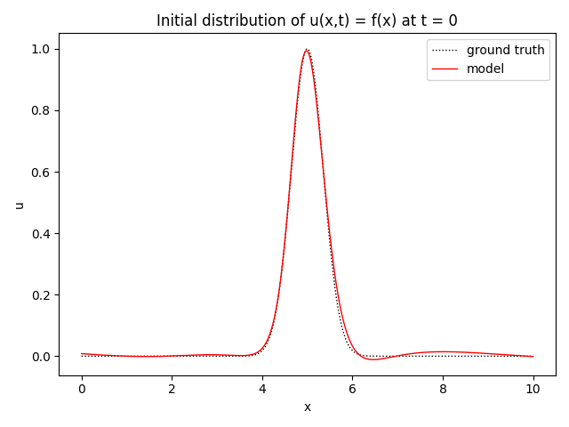

# Physics Informed Neural Network

This is a tensorflow implementation of physics informed neural 
network for solving the one-dimensional wave equation

$$
u'' - c^2 \ddot{u} = 0 \qquad \forall x \in \left(0, L \right ), t \in \left(0, T \right )
$$

with initial conditions

$$
u \left(x, 0 \right ) = f \left(x \right ) \qquad u' \left(x, 0 \right ) = 0 \qquad \forall x \in \left(0, L \right )
$$

and boundary conditions

$$
u \left(0, t \right ) = 0 \qquad u \left(L, t \right ) = 0 \qquad \forall t \in \left(0, T \right )
$$

# Results

